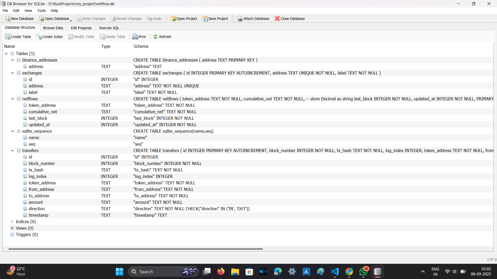
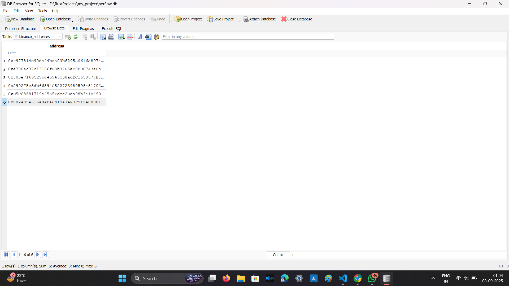
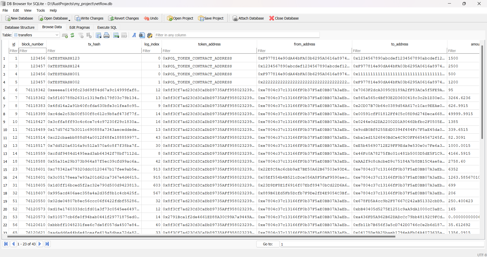
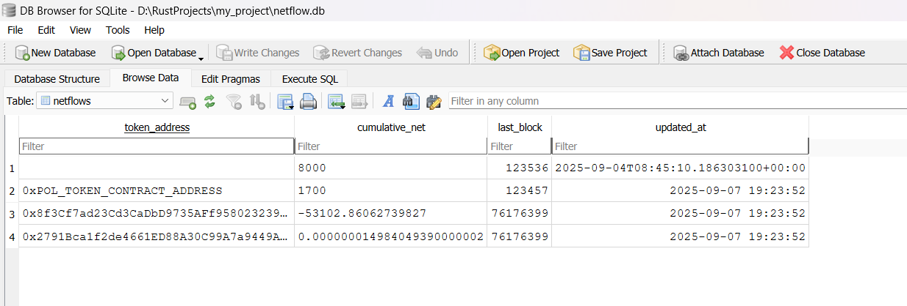
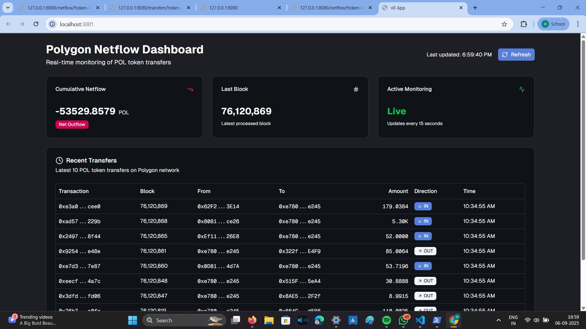

# Real-Time Polygon Blockchain Data Indexer

This project implements a **real-time blockchain data indexer** on the **Polygon network** using Rust.  
It listens for **POL token transfers** involving **Binance exchange addresses**, stores all raw transfers in SQLite, and provides an aggregated view of **cumulative net-flows** through a simple REST API.

Designed with **scalability, reliability, and clean engineering practices** in mind.  

---

# Features

- **Real-time indexing**  
  Continuously fetches the latest Polygon blocks and processes confirmed token transfers.

- **POL token monitoring**  
  Specifically tracks the POL token and its movements involving Binance exchange wallets.

- **Exchange inflow/outflow detection**  

  Classifies transfers as:
  - `IN` → Tokens received by Binance  
  - `OUT` → Tokens sent from Binance  

- **SQLite storage with WAL mode**  
  Ensures persistence, deduplication, and fast queries.

- **Aggregated net-flows**  
  Maintains cumulative inflow, outflow, and net values for each tracked token.

- **Resilient architecture**  
  - Rate limiting between RPC calls (to avoid free-tier bans).  
  - Exponential backoff retry logic for RPC failures.  
  - Batched inserts using transactions for efficiency.  
  - Unique constraints in DB schema prevent duplicates.

- **REST API endpoints**  
  Easy-to-use HTTP interface for retrieving data:
  - `/transfers?token=<address>&limit=10`  
  - `/netflow?token=<address>`  

- **Frontend dashboard** (Next.js + Tailwind)  
  A clean UI to visualize netflows and recent transfers in real-time.

---

# Tech Stack

## Backend
- **Rust**
  - Tokio (async runtime)
  - Tracing (structured logs)
  - Reqwest (HTTP RPC calls)
  - Rusqlite (SQLite database access)
  - Eyre (error handling)

- **Database**
  - SQLite (with WAL mode for safe concurrent writes)

- **Blockchain**
  - Polygon RPC (via Chainstack endpoint)

## Frontend
- **Next.js 14**
- **React Hooks**
- **TailwindCSS + shadcn/ui**
- **Lucide Icons**

---

## Project Structure

```bash
src/
 ├── api.rs          # HTTP server exposing /transfers and /netflow endpoints
 ├── aggregator.rs   # Aggregates raw transfers into cumulative netflows
 ├── config.rs       # Loads configuration (RPC URL, DB path, tokens, exchanges)
 ├── db.rs           # Database schema, migrations, and helper functions
 ├── indexer.rs      # Core indexing logic (fetch logs, decode, store, aggregate)
 ├── parser.rs       # Decodes ERC20 Transfer logs into structured data
 ├── rpc.rs          # Handles JSON-RPC calls to Polygon
 ├── reorg.rs        # Placeholder for chain reorg handling
 ├── cache.rs        # Placeholder for in-memory cache (future improvement)
 └── main.rs         # Entry point (starts API + indexer concurrently)

frontend/dashboard/
 ├── app/page.tsx    # Main UI page
 ├── components/ui   # Reusable UI components (Cards, Tables, Alerts)
 └── ...

## Database Schema

Transfers Table:

Stores all raw transfers

CREATE TABLE IF NOT EXISTS transfers (
    id            INTEGER PRIMARY KEY AUTOINCREMENT,
    block_number  INTEGER NOT NULL,
    tx_hash       TEXT NOT NULL,
    log_index     INTEGER NOT NULL,
    token_address TEXT NOT NULL,
    from_address  TEXT NOT NULL,
    to_address    TEXT NOT NULL,
    amount        TEXT NOT NULL, -- Decimal stored as string
    direction     TEXT NOT NULL CHECK (direction IN ('IN','OUT')),
    timestamp     TEXT NOT NULL DEFAULT (datetime('now')),
    UNIQUE(tx_hash, log_index, token_address)
);

Netflows Table:

Stores aggregated cumulative netflows.

CREATE TABLE IF NOT EXISTS netflows (
    token_address  TEXT PRIMARY KEY,
    cumulative_net TEXT NOT NULL,
    inflow_total   TEXT NOT NULL DEFAULT '0',
    outflow_total  TEXT NOT NULL DEFAULT '0',
    last_block     INTEGER NOT NULL,
    updated_at     TEXT NOT NULL DEFAULT (datetime('now'))
);

## Running the Project

1. Clone the Repository:
  
   git clone https://github.com/Hariomlokhande-coder/polygon-indexer.git
   cd polygon-indexer

2. Backend Setup(Rust):
https://github.com/Hariomlokhande-coder/polygon-indexer.git
a) Install Rust
If not already installed:

    curl --proto '=https' --tlsv1.2 -sSf https://sh.rustup.rs | sh

Verify installation:

    rustc --version
    cargo --version

b)Environment Variables
    Create a .env file in the project root:

# Polygon RPC URL (from Chainstack or Alchemy)
    RPC_HTTP_URL=https://polygon-mainnet.chainstack.com/<your-key>

# SQLite database file
    DB_PATH=netflow.db

# Confirmations to wait before indexing
    CONFIRMATIONS=3

# POL token contract address
    TOKENS=0x8f3Cf7ad23Cd3CaDbD9735AFf958023239c6A063

# Binance addresses to track (comma-separated)
    EXCHANGES=0xF977814e90dA44bFA03b6295A0616a897441aceC,0xe7804c37c13166fF0b37F5aE0BB07A3aEbb6e245,...

NOTE--- Keep your RPC key private. Do not share and commit .env to anywhere like GitHub .

3) Run Database Migrations

cargo run --bin polygon-indexer

---- On first run, this will:
    Create netflow.db
    Initialize schema (transfers, netflows tables)
    Start fetching live Polygon data

---- You should see the logs like:

    INFO  Polygon Indexer starting...
    INFO  API listening on http://127.0.0.1:8080
    INFO  Indexer started with lookback = 10 blocks

--------------- API Endpoints & Testing
1)Transfers:
    Endpoint:
    GET /transfers?token=<token_address>&limit=<N>

Example:
    curl "http://127.0.0.1:8080/transfers?token=0x8f3Cf7ad23Cd3CaDbD9735AFf958023239c6A063&limit=5"

Sample Response:

   [
  {
    "tx_hash": "0xfa119d9...",
    "block_number": 76120651,
    "from_address": "0xe7804c...",
    "to_address": "0xA048F7...",
    "amount": "0.0000000000444259",
    "direction": "OUT",
    "timestamp": "2025-09-06 10:29:06"
  }
]

Netflow:
    GET /netflow?token=<token_address>

Example:
    curl "http://127.0.0.1:8080/netflow?token=0x8f3Cf7ad23Cd3CaDbD9735AFf958023239c6A063"

Sample Response:

{
  "token_address": "0x8f3Cf7ad23Cd3CaDbD9735AFf958023239c6A063",
  "cumulative_net": "-57806.6248",
  "inflow_total": "0",
  "outflow_total": "57806.6248",
  "last_block": 76120723,
  "updated_at": "2025-09-06 10:31:36"
}

4.Frontend Setup (Next.js Dashboard)

a) Install Node.js & pnpm
    Install Node.js (v18+ recommended):
    Download Node.js

Install pnpm:
    npm install -g pnpm

b)Install dependencies
    cd frontend/dashboard/
    pnpm install

c)Run development server
    pnpm dev

By default, it runs on http://localhost:3000.
If port 3000 is busy, Next.js will switch to 3001.

5. View Dashboard
	Open http://localhost:3000
	You’ll see:
	Netflow metrics (cumulative inflow/outflow for POL → Binance)
	Recent Transfers (last 10 token transfers)

6. Database Debugging (Optional)

Check what’s stored in SQLite manually:
    sqlite3 netflow.db "SELECT * FROM transfers ORDER BY block_number DESC LIMIT 5;"
    sqlite3 netflow.db "SELECT * FROM netflows;"

 Notes
	Keep lookback small (10 blocks) if using a free RPC node to avoid rate limits.
	Use Chainstack / Alchemy / Infura RPC for better reliability.
	Always restart backend after modifying .env.

## Edge Cases & Safeguards

   .RPC Failures → Retries with exponential backoff (max 120s).
   .Rate Limits → Inserted sleep(200ms) between requests.
   .Duplicate Logs → Prevented via UNIQUE(tx_hash, log_index, token_address).
   .DB Performance → Batch writes using SQLite transactions.
   .Graceful Shutdown → Listens for ctrl+c signal.
   .Future-Proof → Separate modules (reorg.rs, cache.rs) left as extension points.

## Future Improvements

   .Add full chain reorg handling (rollback affected blocks).
   .Extend multi-token monitoring (already partially supported).
   .Add Prometheus/Grafana metrics for monitoring.
   .Deploy with Docker for easier portability.
   .Improve frontend with charts (inflows vs outflows over time).
   .Add historical backfill mode.

# Screenshots
---- Note: If the image preview is not clickable in GitHub, you can also open the file directly from the docs/screenshots folder.
## Database Schema


## Binance Addresses


## Transfers Table


## Netflows


## Frontend Dashboard


## System Workflow


# Author

    Name of author: Hariom Lokhande
    Contact: hariomlokhande3456@gmail.com | http://linkedin.com/in/hariomlokhande
